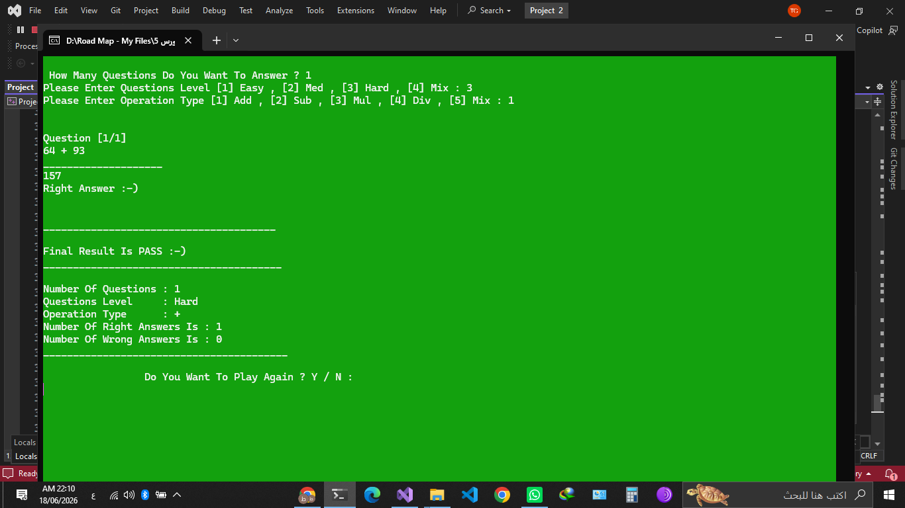
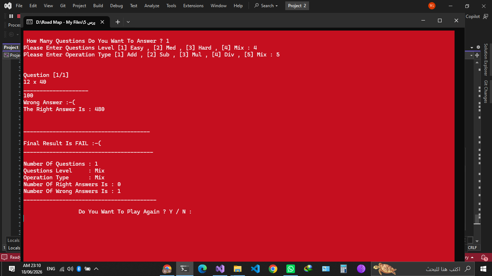

# Math Quiz Game

A simple console-based math game built with C++.

## Features
- Addition questions
- Subtraction questions
- Multiplication questions
- Division questions
- Random question generation
- Score tracking

## Technologies Used
- C++
- Object-Oriented Programming (OOP)

## Screenshot

## How to Run
1. Clone the repository.
2. Open the project in Visual Studio.
3. Build and run the project.
