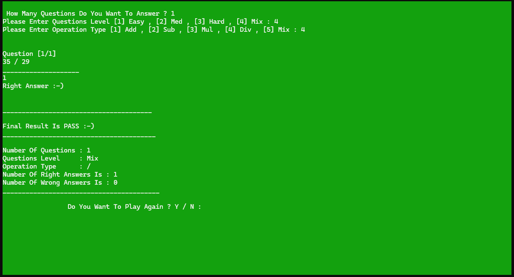
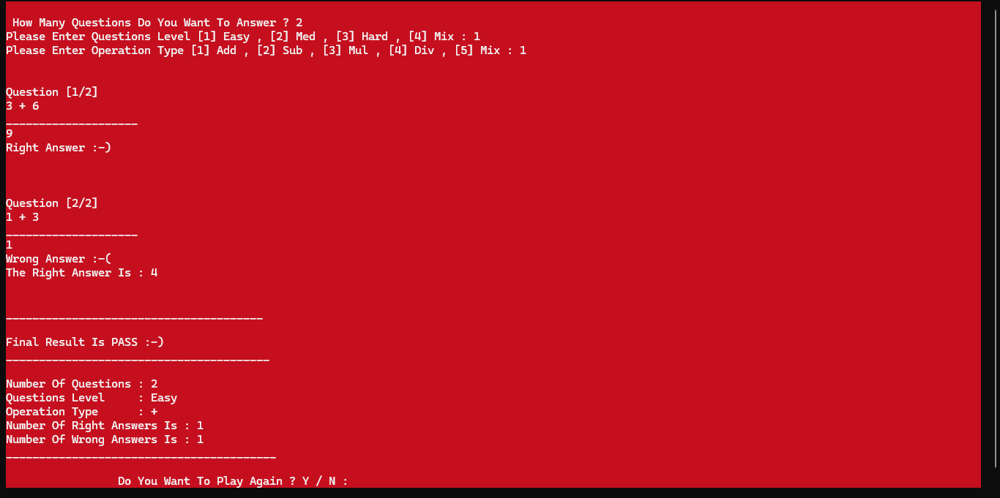

# Math Quiz Game

A simple console-based math game built with C++.

## Features
- Addition, Subtraction, Multiplication & Division questions
- Random question generation
- Score tracking
- Instant feedback

## Technologies
- C++
- OOP

  ## Screenshots

## How to Run
1. Clone the repository
2. Open in Visual Studio
3. Build and run
